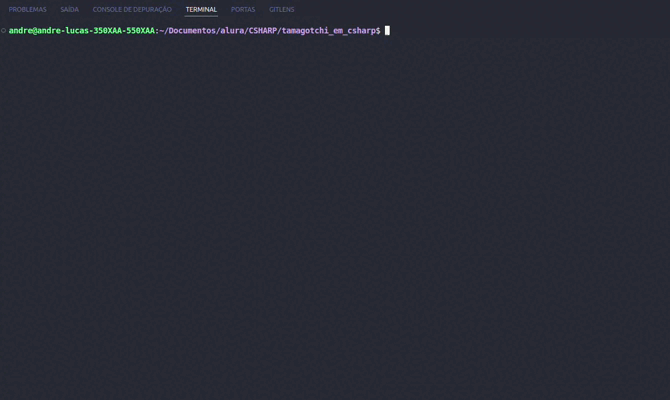

<h1>Desafio 7 Days of C# - Tamagotchi Pokémon</h1>

<h2>Descrição</h2>

  Reviva a nostalgia do Tamagotchi com este desafio de 7 dias em C# que utiliza a API do Pokémon para trazer seus mascotes favoritos à vida e permitir interações via API e JSON. Usando os conceitos mais importantes do C# e consumindo a API do Pokémon.

<h2>Tecnologias Utilizadas</h2>
<ul>
  <li>C#</li>
  <li>API do Pokémon</li>
  <li>JSON</li>
</ul>

<h2>Visualize a aplição</h2>
